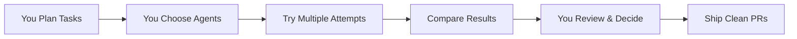

<p align="center">
  <a href="https://forge.automag.ik">
    
  </a>
</p>
<h2 align="center">The Vibe Coding++™ Platform for Human-AI Development</h2>

<p align="center">
  <strong>🎯 Where Vibe Coding Meets Structured Execution</strong><br>
  Works with any AI coding tool through natural language, execute in isolated environments,<br>
  ship confident code with complete control and visibility
</p>

<p align="center">
  <a href="https://www.npmjs.com/package/@automagik/forge"></a>
  <a href="https://github.com/namastexlabs/automagik-forge/actions"></a>
  <a href="https://github.com/namastexlabs/automagik-forge/blob/main/LICENSE"></a>
  <a href="https://discord.gg/xcW8c7fF3R"></a>
  <a href="https://github.com/orgs/namastexlabs/projects/9/views/1?filterQuery=project%3Aforge"></a>
</p>

<p align="center">
  <a href="#-key-features">Features</a> •
  <a href="#-quick-start">Quick Start</a> •
  <a href="https://github.com/orgs/namastexlabs/projects/9/views/1?filterQuery=project%3Aforge">Roadmap</a> •
  <a href="#-development">Development</a> •
  <a href="#-contributing">Contributing</a>
</p>

<!-- Screenshot placeholder - add your Forge dashboard screenshot here -->

---

## 📦 Quick Start

### Prerequisites

- Node.js 18+ and pnpm 8+ (tested with pnpm 10.12.4)
- Git repository to work with

### Installation

```bash
# Install globally
npm install -g @automagik/forge

# Or run directly with npx
npx @automagik/forge
```

### First Run

```bash
# Navigate to your project
cd your-project

# Launch Forge (browser opens automatically to http://localhost:8887)
automagik-forge
```

---

## 🚀 What is Automagik Forge?

**Automagik Forge** is the vibe coding++ platform where humans stay in control. It's the structured home for your AI-powered tasks - plan them yourself or use Genie to help, experiment with different providers and agents to find what works, review everything before shipping. Perfect for development, content, and any AI-assisted work.

### 🎭 Vibe Coding++™ Philosophy

**Regular vibe coding problem**: You chat with AI, get output, ship it. Two weeks later? Things break and you can't fix them because you let AI do everything without understanding.

**Vibe Coding++™ solution**: Perfect human-AI integration where you:

- 📋 **You Plan Tasks**: Break down work yourself or use Genie AI assistant to help plan
- 🏠 **Forge is Home**: All tasks live in persistent kanban, not lost in chat history or random .md files scattered across your codebase
- 🧪 **You Experiment**: Try different providers and agents on same task - see what works best
- 🎯 **You Choose**: Pick which provider (Claude, Gemini, etc.) and agent (test-writer, security-expert) for each task
- 🔒 **Isolated Attempts**: Each attempt in its own Git worktree - no conflicts
- 👀 **You Review**: Understand what changed before merging
- 🚀 **Ship with Confidence**: Work you understand and can maintain

### 🚀 The 10x Productivity Advantage

Forge delivers exponential productivity through intelligent parallelism:
- **Run Multiple Tasks Simultaneously**: While one agent writes tests, another fixes bugs, and a third refactors code
- **Never Wait**: No sequential bottleneck - scale your output by running many agents at once
- **Total Visibility**: Every task, every attempt, every change tracked and visible in one place
- **Nothing Forgotten**: Persistent kanban means no work is lost, everything has context
- **Structured Execution**: Tasks you control, not scattered in chat history or random .md files

### ✅ The Vibe Coding++™ Solution

Forge elevates human potential - you orchestrate, AI executes:
- **You Own the Kanban**: Tasks you create, not AI's whims
- **You Pick Provider + Agent**: Try Claude with test-writer agent, then Gemini with security agent
- **Multiple Attempts**: Each task can have multiple attempts with different providers/agents
- **Genie AI Assistant**: Optional `.genie` integration for AI-assisted planning and custom agents
- **Git Worktree Isolation**: Every attempt isolated, no conflicts
- **You Review & Understand**: Know exactly what's changing before merge
- **MCP Control**: Create/update tasks from your coding agent without leaving your flow

### 🎯 The Wish → Forge → Review Framework

Forge uses a three-phase workflow that maps directly to the kanban columns:

**1. Wish** (Planning Phase)
- Create tasks yourself or use Genie AI assistant to help break down complex work
- Define clear requirements and acceptance criteria
- Attach screenshots, diagrams, and context
- Tasks live in "Wish" column until you're ready to execute

**2. Forge** (Execution Phase)
- Pick your provider (Claude, Gemini, etc.) and agent (test-writer, security-expert, etc.)
- Execute tasks in isolated Git worktrees - run multiple tasks in parallel
- Watch real-time progress, see diffs as they happen
- Create multiple attempts with different providers/agents to find what works best
- Tasks move to "Forge" column during execution

**3. Review** (Validation Phase)
- Compare attempts side-by-side, understand what changed
- Review diffs, run tests, validate quality
- Choose the best attempt to merge
- Ship with confidence - work you understand and can maintain
- Tasks move to "Review" column when ready for your approval

**The Power:**
- **Total Control**: You orchestrate, AI executes
- **Maximum Parallelism**: Run many tasks simultaneously for 10x productivity
- **Complete Visibility**: Nothing is hidden, everything tracked
- **No Surprises**: Review before merge, understand before ship

---

## 🌟 Key Features

- **8 AI Providers**: Claude Code, Cursor, Gemini, Codex, and more - including open-source options
- **Custom Agents**: Add specialized behavior to any provider (test-writer, security-expert, refactor-specialist, content-writer)
- **Genie Integration**: Auto-detects `.genie` folders and activates Genie Lamp for AI assistant capabilities
- **Multiple Attempts Per Task**: Try different providers and agents, compare results, choose the best
- **Parallel Execution**: Run multiple agents simultaneously on different tasks
- **Git Worktree Isolation**: Every attempt in its own isolated environment
- **Persistent Kanban Board**: Tasks live forever, not lost in chat history
- **MCP Server Built-in**: Control from any AI coding agent without leaving your flow
- **Visual Context**: Attach screenshots and diagrams to tasks
- **Real-time Progress**: Watch agents work, see diffs as they happen
- **GitHub Integration**: OAuth authentication and repository management
- **100% Open Source**: Free forever, self-hostable, no vendor lock-in

---

## 🤖 Providers + Agents: Two-Layer Flexibility

### 🛠️ How It Works

**Layer 1: Providers** (Who executes the task)
- **Claude Code** - Anthropic's Claude models (supports Router for any LLM)
- **Cursor** - Cursor's AI capabilities
- **Gemini** - Google's Gemini models
- **Codex** - OpenAI's models
- **Amp** - Sourcegraph's code intelligence
- **OpenCode** - Open-source models, fully local
- **Qwen Code** - Alibaba's open-source models
- **Copilot** - GitHub Copilot integration

**Layer 2: Agents** (How they should behave)
- Add specialized behavior to any provider via custom prompts
- Create agents for any purpose: "test-writer", "security-expert", "content-writer", "documentation-specialist"
- Agents work with ANY provider - same behavior, different AI model

**Example:** Your "test-writer" agent can run on Claude today, Gemini tomorrow, or your local LLM next week.

**The Power:** Not locked to subscriptions - use open-source models, route to any LLM, bring your own API keys, customize for coding OR general tasks

### 🧪 Task Attempts: Experiment Until It Works

Each task can have multiple attempts - try different approaches:

```yaml
Task: "Implement user authentication"
├── Attempt 1: Claude Code → Too complex
├── Attempt 2: Gemini → Missing edge cases
├── Attempt 3: Cursor Agent → Perfect! ✅
└── Result: You choose Attempt 3 to merge
```

**The Power of Attempts:**
- Each attempt runs in isolated Git worktree
- Compare different agent outputs side-by-side
- No commits until YOU approve
- Learn which agent works best for which task type

---

## 🧞 Genie Integration: Your AI Assistant

Forge works seamlessly with [Automagik Genie](https://github.com/namastexlabs/automagik-genie) for AI-assisted task planning and execution.

**Setup:**
```bash
npm install -g automagik-genie
cd your-project
genie init
```

**What You Get:**
- **Master Genie Widget**: AI assistant for planning and breaking down complex work
- **Custom Agents**: Backend auto-loads agents from `.genie/agents/` directory
- **Unified Workflow**: Plan with Genie MCP, execute in Forge, review results

**Integration Status:**
- ✅ Backend: Auto-detects `.genie` folder, loads custom agents, hot-reloads on changes
- 🚧 Frontend: Master Genie widget available, full agent UI coming soon

**Learn more:** [github.com/namastexlabs/automagik-genie](https://github.com/namastexlabs/automagik-genie)

---

## 📡 MCP: AI Assistant Integration

Control Forge from your AI coding tools using Model Context Protocol (MCP).

### 🧞 Genie MCP (Recommended)

Natural language AI assistant for planning and managing Forge tasks.

```bash
npm install -g automagik-genie
```

**Claude Desktop config:**
```json
{
  "mcpServers": {
    "genie": {
      "command": "genie",
      "args": ["mcp"]
    }
  }
}
```

**What you can do:**
- "Help me plan an authentication system" → Creates organized tasks
- "Run code agent on task-123" → Executes Forge tasks
- "Show active sessions" → Monitor all work in progress

<details>
<summary><b>⚙️ Forge MCP (Advanced - 50+ Tools)</b></summary>

Direct API control for power users. Full programmatic access to all Forge features.

**Command:** `npx @automagik/forge --mcp`

**Config example:**
```json
{
  "mcpServers": {
    "forge": {
      "command": "npx",
      "args": ["@automagik/forge", "--mcp"],
      "env": {
        "PROJECT_ID": "your-project-uuid"
      }
    }
  }
}
```

**Tools:** Task CRUD, attempts, processes, images, filesystem, config, and more.

</details>

**Get Project ID:** Open Forge UI, check browser URL: `/projects/{PROJECT_ID}/tasks`

---

## 🎭 Vibe Coding++™ Workflows

### Human Orchestration, Not AI Automation



### Example: Building a Feature
```bash
You: "I need a user dashboard with charts and real-time updates"

Your Process:
1. YOU create tasks (or use Genie to help plan):
   ├── Task 1: Design dashboard layout
   ├── Task 2: Create chart components
   ├── Task 3: Build WebSocket service
   ├── Task 4: Write integration tests
   └── Task 5: Generate documentation

2. YOU experiment with different providers + agents:
   Task 2 - Chart Components:
   ├── Attempt 1: Claude Code (default) → Too abstract
   ├── Attempt 2: Cursor (refactor agent) → Good but verbose
   └── Attempt 3: Gemini (component-specialist agent) → Perfect! ✅

3. YOU review and choose what to merge

The Power: You're in control, not hoping AI gets it right
```

---

## 📊 Vibe Coding vs Vibe Coding++™

| Feature | Forge (Vibe Coding++™) | Lovable (Regular Vibe Coding) |
|---------|----------------------|-------------------------------|
| **Human Control** | ✅ You orchestrate every decision | ❌ AI acts autonomously |
| **Task Persistence** | ✅ Kanban board - tasks live forever | ❌ Lost in chat conversations |
| **Multiple Attempts** | ✅ Try different providers/agents per task | ❌ One AI, one approach |
| **8 AI Providers** | ✅ Claude Code, Cursor, Gemini, etc. | ❌ Single AI model |
| **Custom Agents** | ✅ Add specialized behavior to any provider | ❌ Fixed behavior |
| **Genie Integration** | ✅ Auto-detects .genie, activates Lamp | ❌ No AI assistant integration |
| **Git Worktree Isolation** | ✅ Every attempt isolated | ❌ Direct changes |
| **MCP Server** | ✅ 8+ tools for remote control | ❌ No external integration |
| **2-Week Curse Protection** | ✅ You understand the work | ❌ AI black box magic |
| **Code Review** | ✅ Review before merge | ❌ Auto-applies changes |
| **Visual Context** | ✅ Attach screenshots to tasks | ✅ Can generate images |
| **Open Source** | ✅ 100% open-source | ❌ Proprietary |
| **Pricing Model** | ✅ Free forever | 💰 Usage-based credits |
| **Self-Hostable** | ✅ Your infrastructure | ❌ Cloud-only |

---

## 🛠️ Development

### Quick Start

```bash
# Clone the repository
git clone https://github.com/namastexlabs/automagik-forge.git
cd automagik-forge

# Copy environment example (optional - only needed for custom ports)
cp .env.example .env

# Start development server
make dev

# Or build and test production package
make prod
```

**Port Configuration:**
- Copy `.env.example` to `.env` to customize ports
- Defaults work out of the box - no configuration needed!
- Everything else is automated!

**See also:** [DEVELOPER.md](DEVELOPER.md) for architecture details and advanced topics

### Upstream Management

Automagik Forge uses a mechanical rebranding approach to stay in sync with the upstream vibe-kanban template:

**Architecture:**
- `upstream/` - Git submodule pointing to namastexlabs/vibe-kanban fork
- `namastexlabs/vibe-kanban` - Fork that mirrors BloopAI/vibe-kanban
- `scripts/rebrand.sh` - Converts all vibe-kanban references to automagik-forge
- `forge-core/` - Core services (profiles, config) migrated from extensions
- Minimal `forge-overrides/` - Only feature files, no branding

**Complete Workflow:** Sync fork → Create namastex tag → Update gitmodule → Rebrand → Verify & commit

#### Updating to New Version

**Automated (recommended):**
```bash
# From automagik-forge repo
mcp__genie__run agent="utilities/upstream-update" prompt="Update to v0.0.106"
```

**Manual:**
```bash
# 1. Sync fork (in namastexlabs/vibe-kanban repo)
git remote add upstream https://github.com/BloopAI/vibe-kanban.git
git fetch upstream --tags
LATEST_TAG=$(git tag --list 'v0.0.*' --sort=-version:refname | head -1)
git reset --hard upstream/main
git push origin main --force

# 2. Create namastex release tag
NAMASTEX_TAG="${LATEST_TAG%-*}-namastex"
git tag -a $NAMASTEX_TAG -m "Namastex release based on $LATEST_TAG"
git push origin $NAMASTEX_TAG
gh release create $NAMASTEX_TAG --repo automagik.dev/vibe-kanban --title "$NAMASTEX_TAG" --notes "Based on $LATEST_TAG"

# 3. Update gitmodule (in automagik-forge repo)
cd upstream
git fetch origin --tags
git checkout $NAMASTEX_TAG
cd ..

# 4. Apply mechanical rebrand
./scripts/rebrand.sh

# 5. Verify success
grep -r "vibe-kanban" upstream frontend | wc -l  # Must be 0
cargo check --workspace
cd frontend && pnpm run check

# 6. Commit changes
git add -A
git commit -m "chore: update upstream to $NAMASTEX_TAG and rebrand"
```

**Total time:** ~3-5 minutes. Full automation via agent!

---

## 🗺️ Roadmap

### Completed ✅
- [x] Multi-agent orchestration
- [x] Kanban task management
- [x] Git worktree isolation
- [x] MCP server implementation
- [x] Real-time progress streaming

### Next Up 🚀
- [ ] **Wish System & Genie** - Natural language wishes become epics with subtasks, interactive AI assistant navigates the UI
- [ ] **Bilateral sync** - Two-way sync with GitHub Issues, Jira, Notion, Linear
- [ ] **Epics & Subtasks** - Hierarchical task organization with dependency management
- [ ] Agent performance analytics
- [ ] Team collaboration features
- [ ] Community templates
- [ ] Integration with CI/CD pipelines

---

## 🧪 E2E Testing with Playwright

Forge uses **Playwright** for end-to-end testing with an LLM-friendly approach:

### Running Tests

```bash
# Run all tests
pnpm test:e2e

# Run with UI mode (visual debugging)
pnpm test:e2e:ui

# Run in headed mode (see browser)
pnpm test:e2e:headed

# Debug mode (step through tests)
pnpm test:e2e:debug
```

### Writing Tests

Our E2E tests follow **user journey patterns** - complete flows from start to finish:
- See `tests/e2e/USER-JOURNEYS.md` for documented user journeys
- Use `tests/e2e/journey-create-task.spec.ts` as a template
- Follow the framework guide in `tests/e2e/README.md`

**Why Playwright?**
- ✅ Real browser events (no synthetic event issues)
- ✅ Auto-wait built-in (no manual timeouts)
- ✅ Accessibility-first selectors (semantic, non-invasive)
- ✅ Excellent debugging (screenshots, videos, time-travel traces)

---

## 🤝 Contributing

We love contributions! However, to maintain project coherence:

1. **Discuss First**: Open an issue before starting work
2. **Align with Roadmap**: Ensure changes fit our vision
3. **Follow Standards**: Match existing code patterns
4. **Test Thoroughly**: Include tests for new features
5. **Document Well**: Update docs with your changes

See [CONTRIBUTING.md](CONTRIBUTING.md) for detailed guidelines.
---

## 🙏 Acknowledgments

Special thanks to:
- Vibe Kanban team, whose original vision inspired Automagik Forge's evolution.
- All our early adopters and contributors

---

## 📄 License

MIT License - see [LICENSE](LICENSE) file for details.

---

## 🔗 Links

- **Website**: [forge.automag.ik](https://forge.automag.ik)
- **NPM Package**: [npmjs.com/package/@automagik/forge](https://www.npmjs.com/package/@automagik/forge)
- **GitHub**: [github.com/namastexlabs/automagik-forge](https://github.com/namastexlabs/automagik-forge)
- **Discord**: [discord.gg/xcW8c7fF3R](https://discord.gg/xcW8c7fF3R)
- **Twitter**: [@namastexlabs](https://twitter.com/namastexlabs)

---

<p align="center">
  <strong>🚀 Stop the 2-week curse. Start shipping work you actually understand.</strong><br>
  <strong>Vibe Coding++™ - Where Human Control Meets AI Power</strong><br><br>
  <a href="https://github.com/namastexlabs/automagik-forge">Star us on GitHub</a> •
  <a href="https://discord.gg/xcW8c7fF3R">Join our Discord</a> •
</p>

<p align="center">
  Made with ❤️ by <a href="https://namastex.ai">Namastex Labs</a><br>
  <em>AI that elevates human potential, not replaces it</em>
</p>
<a href="https://deepwiki.com/namastexlabs/automagik-forge"></a>
 
 
